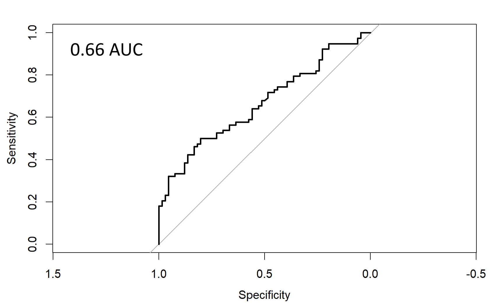
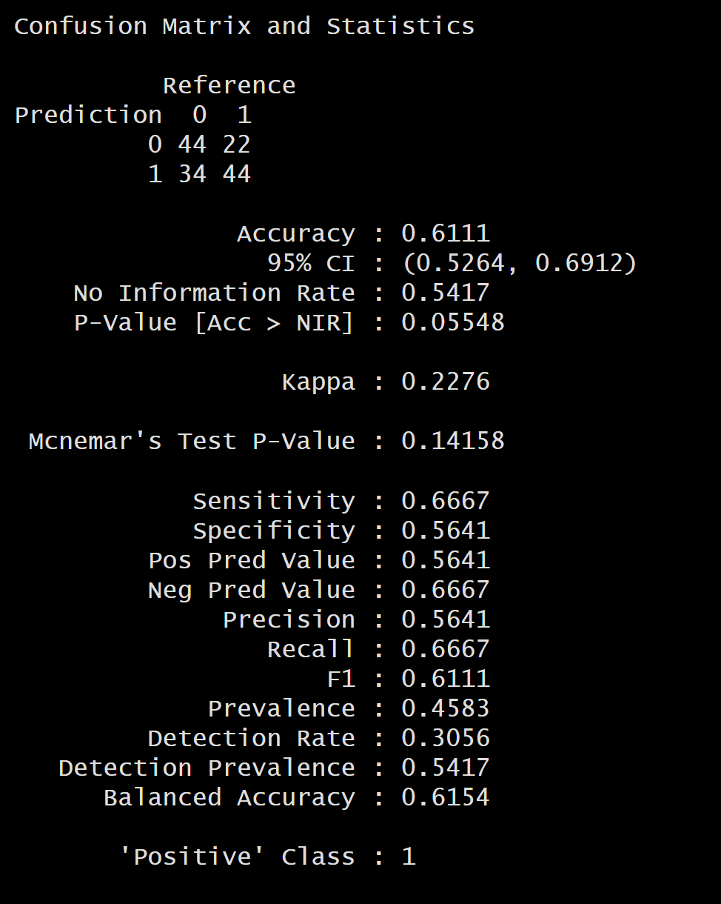
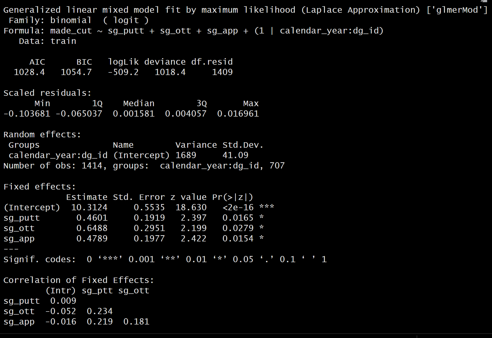
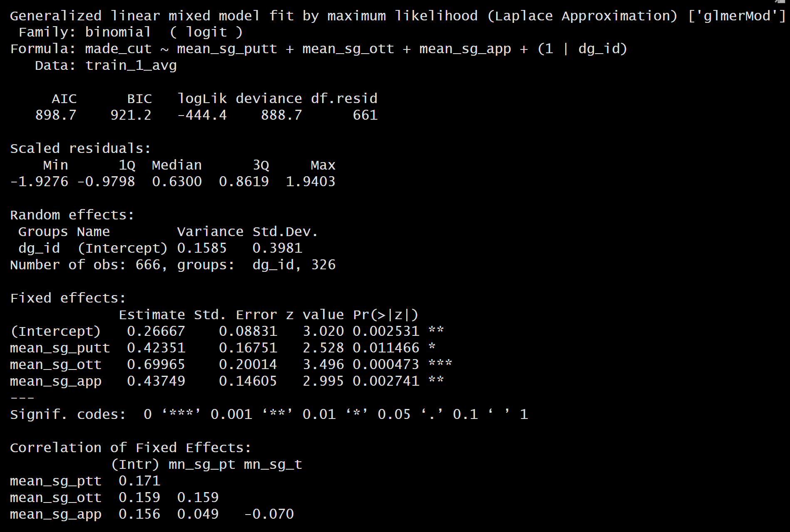
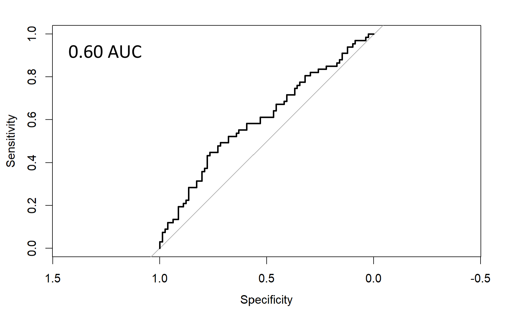
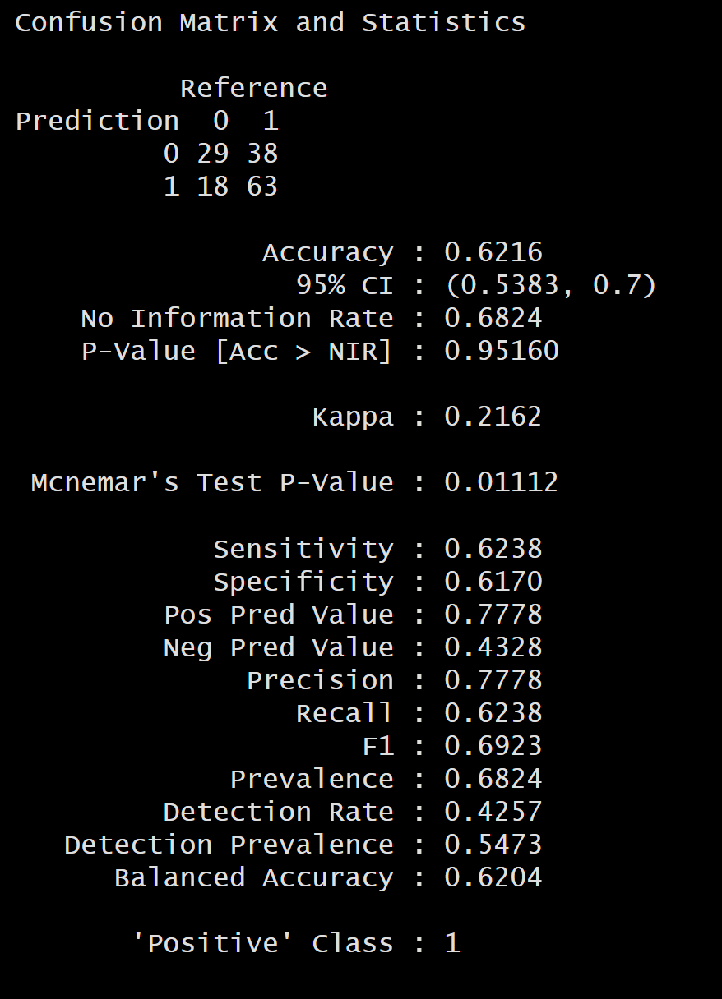

# Overview

The purpose of this study is to predict which golfers make the 2025 Valero Texas Open at a similar or better accuracy than Datagolf.com, a leading golf statistics and modeling website.

# Datagolf.com Baseline Predictions

-   0.66 AUC and F1 Score of 0.61 is the baseline that will attempt to be improved in this study.

# Data

-   Valero Texas Open Round data with advanced stats (strokes gained) are available 2017 onward from Datagolf.com
-   A couple dozen rounds were missing proximity in the rough data so they were imputed from the other round data
-   training set: 2018 - 2023
-   validation set: 2024
-   test set: 2025

# Course Analysis

-   The Valero Texas Open is played at TPC San Antonio - AT&T Oaks. An attempt was made to see where strokes are typically gained.
-   Various models were produced and they all seemed to portray strokes gained off the tee as the most significant at this particular course (which aligns with typical media coverage of the event)
-   AIC supports a mixed model with calendar year \<-\> golfer interaction having a major impact on making the cut. This may be due to weather or participating golfer competition for each specific year.

The log odds of fixed effects for model 1 are 0.4601 (strokes gained putting), 0.6488 (strokes gained off the tee), 0.4789 (strokes gained approach). All 3 inputs are significant, but there is a larger fixed effect for strokes gained off the tee indicating golfers with better driving skills are more likely to make the cut (almost 2x more likely vs 1.5 times more likely for putting and approach). The ratio of higher significance is 0.6488/(\~0.47) = \~1.4.

This ratio is interesting and could potentially be used to refine preliminary training, validation, and test data. e.g. find courses with similar importance off the tee for training and validating a model.

# Model 1

-   mixed effects logistic regression model with random golfer effects and fixed strokes gained effects
-   averaged strokes gained measures from 4 months of prior tournaments, all available rounds

-   0.60 AUC and F1 Score of 0.69

Model 1's F1 score of 0.69 is higher than Data Golf's F1 Score. However, the AUC is slightly lower at 0.60.

The ratio of golfers predicted to make the cut is heavy at 0.68 which slightly invalidates F1 score since the predicted values are imbalanced. AUC is more reliable, so this model has not improved performance over Data Golf. With that said, 148 golfers is a large number. Combined with the predicted ratio to make the cut, this results in 101 golfers which is way higher than the \~65 standard for Valero.

The threshold can be increased for predicted probability to make the cut to decrease the number of golfers that make the cut.This model produces an F1 score of 0.69 which is a good start as this is better than Data Golf's prediction. However, the AUC is slightly lower at 0.60 (vs 0.66).

The F1 score decreases when the predicted probability threshold is increased from 0.5 to 0.565 which suggests this model is overfit or not ideal. It might make more sense to look at a linear regression model for score after 2 rounds, then select the lowest 65 to 70 predicted scores as the cut line (for ties). This number can be adjusted depending on what the model is used for (e.g. for betting, a tighter threshold to limit losses)

# Current Research

Instead of training on prior 4 months of all available PGA events for each golfer, an analysis is being compiled for all courses with at least 3 prior years of round data. Courses with similar strokes gained significance between putting, off-the-tee, and approach will be utilized to train, validate, and test a model.

Furthermore, linear regression may be utilized to predict stroke count after 2 rounds in order to more accurately select golfers within the cut line (typically top ~65 golfers).
