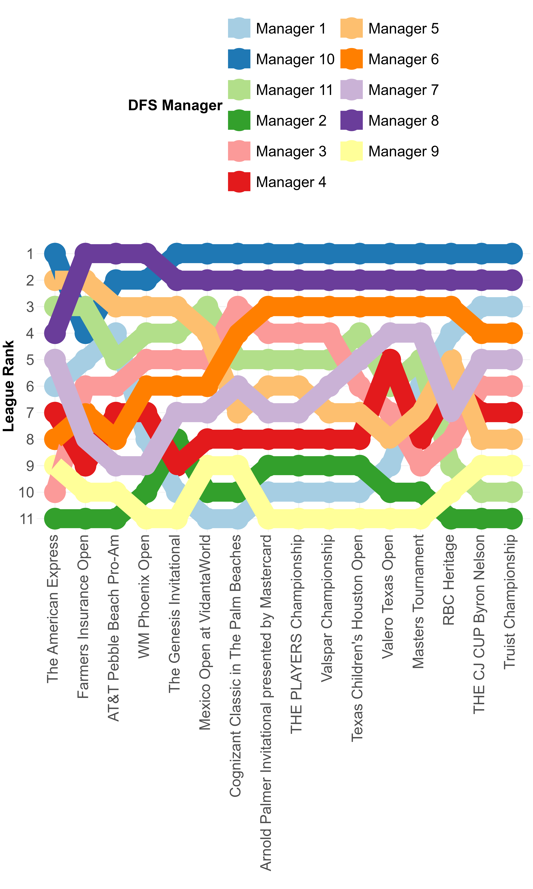
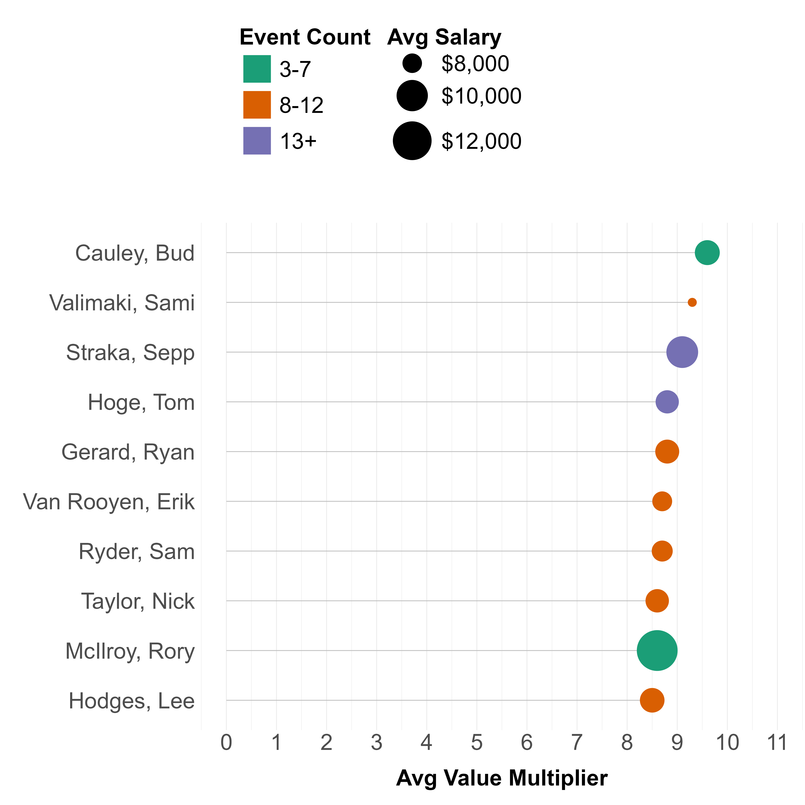
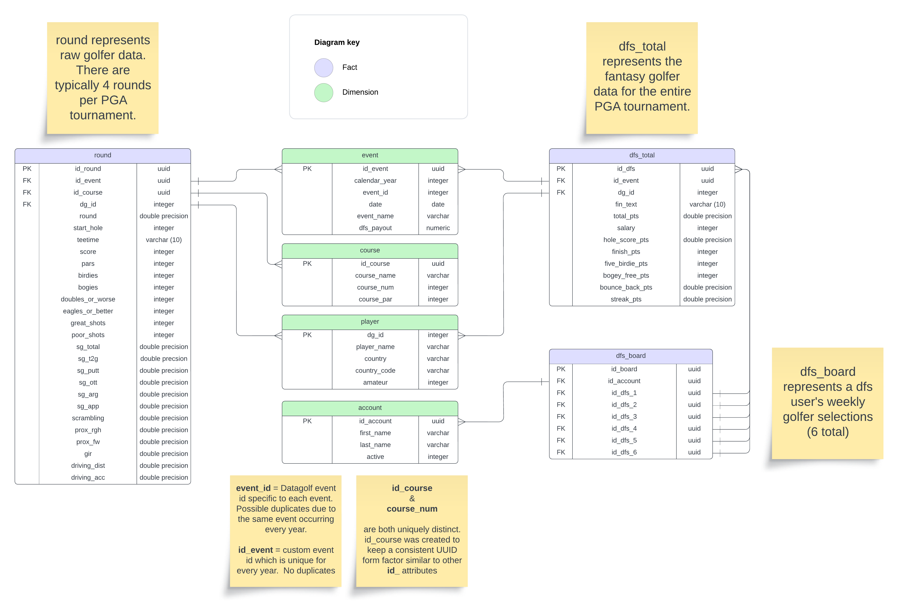

# Overview

As commissioner of a PGA Golf Daily Fantasy Sports (DFS) League, it is advantageous and fun to share statistics about the league. There are typically very little analytics provided for PGA Golf DFS outside of weekly contest standings/earnings and overall league standings. PGA Golf DFS typically involves the selection of 6 golfers for each weekly contest. Each golfer has a salary based on their ability and each DFS league member has a salary cap. DFS league members must select 6 golfers within the salary cap who then receive points based on how well they do in the contest. Total points are aggregated and DFS league members compete against other members within the league. The DFS league member with the highest point total aggregated from their 6 chosen golfers wins that week's contest and a small payout.  Year-end league leaders typically win a larger payout.

# Example Analytics and Diagrams

-   how are DFS league member rankings trending?

-   which golfers are selected by the league most often/least often?
-   which golfers have provided the best value to the league? to the DFS league member? (i.e. low salary cost, high point total)

-   which golfers have provided the lowest value to the league? to the DFS league member? (i.e. high salary cost, low point total)
-   what are the total weekly earnings to date for each DFS league member?

-   which DFS league member has the best 'made-cut' percentage?
-   which DFS league member has missed the most contests? (forgot to set their lineup)

# Purpose

Web-scraping is against the Terms and Conditions of DFS websites (and many other sports data websites), so a subscription was purchased from DataGolf.com which includes historical PGA course statistics and DFS statistics through partnerships. Data is accessed through an API which is great for limited information (e.g. last year's Masters results, upcoming event/course information, DFS salaries for a specific event, etc). However, the API would require tedious looped scripts for any potential predictive model building. Therefore, **the purpose of this repository is to develop a database of historical PGA golfer data as well as DFS data that is continuously updated on a weekly basis.** The database can then be queried for efficient analytics and predictive modeling.

# Database Schema

# Files & Folders

-   **datagolf_batch_processing.qmd** - Batch upload historical data to custom AWS Postgre SQL Relational Database
-   **lambda_builder.ipynb** - Build/maintain a Python script to extract, transform, and load new information to the AWS database (this will be added to a lambda script in AWS after feasibility testing)
-   **dfs_manual_upload.qmd** - Build/maintain an R script to manually upload PGA Daily Fantasy Sports (DFS) selections into the AWS database
-   **Newsletters** folder - Build/maintain R scripts that aggregate League Analytics and provide monthly league newsletters
-   **Models** folder - Build scripts to model or predict outcomes based on golf course features, historical golfer performance, etc.

