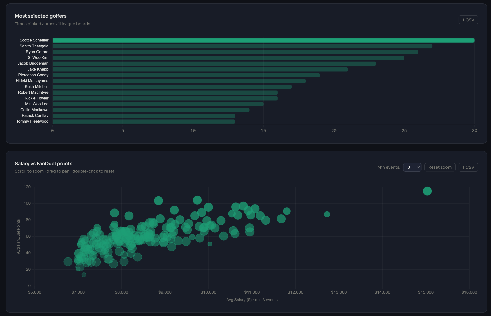
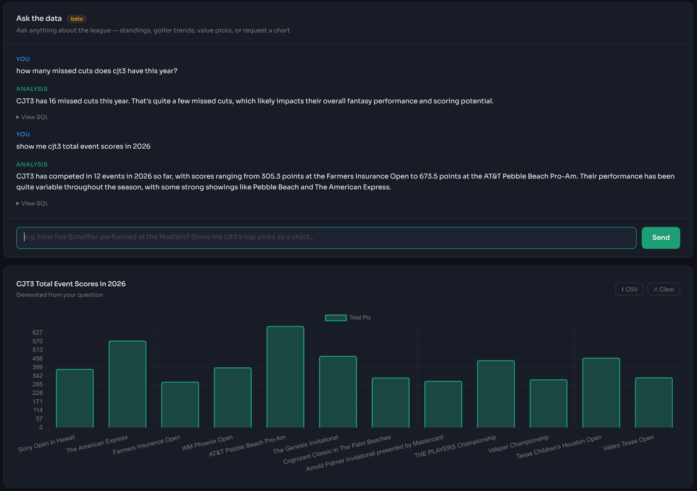
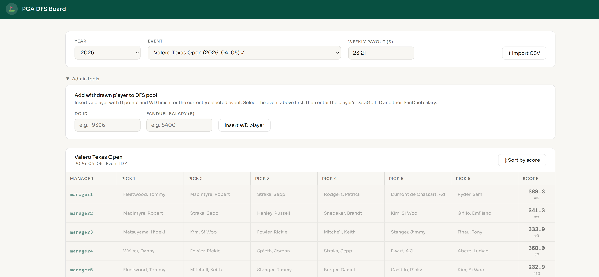

# Overview

As commissioner of a PGA Golf Daily Fantasy Sports (DFS) League, it is advantageous and fun to share statistics about the league. There are typically very little analytics provided for PGA Golf DFS outside of weekly contest standings/earnings and overall league standings. PGA Golf DFS typically involves the selection of 6 golfers for each weekly contest. Each golfer has a salary based on their ability and each DFS league member has a salary cap. DFS league members must select 6 golfers within the salary cap who then receive points based on how well they do in the contest. Total points are aggregated and DFS league members compete against other members within the league. The DFS league member with the highest point total aggregated from their 6 chosen golfers wins that week's contest and a small payout.  Year-end league leaders typically win a larger payout.

# Purpose

Web-scraping is against the Terms and Conditions of DFS websites (and many other sports data websites), so a subscription was purchased from DataGolf.com which includes historical PGA course statistics and DFS statistics through partnerships. Data is accessed through an API which is great for limited information (e.g. last year's Masters results, upcoming event/course information, DFS salaries for a specific event, etc). However, the API would require tedious looped scripts for any potential predictive model building. Therefore, **the purpose of this repository is to develop a database of historical PGA golfer data as well as DFS data that is continuously updated on a weekly basis.** The database can then be queried for efficient analytics and predictive modeling.

# De-Identified League Dashboard

[Link to Dashboard](https://buildmeupbuttercut.s3.us-east-1.amazonaws.com/dashboard-public.html)

# Database Schema

# Script Descriptions

-   **datagolf_batch_processing.qmd** - Original batch upload script - historical data to custom AWS Postgre SQL Relational Database
-   **dfs_manual_upload.qmd** - Quarto R script to manually upload PGA Daily Fantasy Sports (DFS) selections into the AWS database (see dfs_api_lambda.py for new cleaner GUI)

## api folder

-   **dfs_api_lambda.py** - api that handles manual updating of dfs manager golfer picks (through local GUI) and league analytics dashboard

## lambda Folder

-   **lambda_builder.ipynb** - Built Python notebook to manually extract, transform, and load new information to the AWS database 
-   **lambda_function.py** - function that is zipped with libraries for AWS Lambda to automate weekly updates to the db

